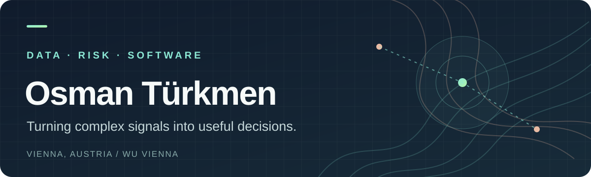

  

  <a href="#selected-work">Selected work</a> &nbsp;·&nbsp;
  <a href="#where-i-work">Where I work</a> &nbsp;·&nbsp;
  <a href="mailto:osmantr820@gmail.com">Get in touch</a>

## Hi, I'm Osman.

I study **Business Informatics at WU Vienna** and work at the intersection of **data science, risk, and useful software**. I like the part of a project where messy data becomes a question worth answering — and the part where an answer has to hold up outside a notebook.

My work moves between satellite imagery, bank portfolios, chess positions, and browser-based machine learning. The common thread: **make complex signals easier to understand and act on.**

## Selected work

### 01 / Give a small gesture a useful interface

**[Signly](https://github.com/OsmanTuerkmen/signly)** is a browser-based research prototype that recognizes a small vocabulary of isolated ASL signs. It combines hand and pose landmarks, a temporal model, and local ONNX inference. Camera frames stay on the device. It is a 12-word experiment, not continuous sign-language translation.

`React` · `TypeScript` · `MediaPipe` · `ONNX Runtime Web` · `Python`

### 02 / Read the landscape as data

In a **[flood-risk project with infrared.city](https://github.com/OsmanTuerkmen/Floodrisk-project)**, our WU team explored how satellite imagery, elevation models, rainfall, and map data can inform urban flood susceptibility. My focus included geospatial analysis and features such as vegetation, built-up area, and terrain slope.

`Python` · `R` · `Geospatial analysis` · `Remote sensing`

### 03 / Put probabilities on a chessboard

**[Predict the Unpredictable](https://github.com/OsmanTuerkmen/chess-outcome-prediction)** asks whether the outcome of a game can be estimated while it is still being played. Using more than 130,000 Lichess games, I explored engine evaluations, player strength, time pressure, and models that produce win probabilities — with calibration in mind.

`R` · `Lichess API` · `Stockfish` · `Random Forest` · `Logistic Regression`

### 04 / Check what a language model actually learned

For **[emotion detection with DistilRoBERTa](https://github.com/OsmanTuerkmen/Large-Language-Model-Finetuning)**, I compared a pretrained baseline with a fine-tuned model and examined where different emotion labels make the comparison difficult. The goal was a more honest evaluation, not just a better headline metric.

`Python` · `PyTorch` · `Transformers` · `scikit-learn`

## Where I work

- **Raiffeisen Bank International** — working student in Recovery & Resolution Planning, supporting strategic and regulatory work, analysis, and digitalization.
- **Oesterreichische Nationalbank** — former research assistant working with credit and climate-risk data. I contributed to geospatial analysis and a working paper **in preparation** on flood exposure in Austrian credit portfolios.
- **WU Vienna** — BSc in Business, Economics and Social Sciences, majoring in Business Informatics, with a focus on data science and information management.

## My working kit

`Python` · `R` · `SQL` · `pandas` · `scikit-learn` · `PyTorch` · `ggplot2` · `Shiny` · `QGIS` · `sf` · `terra` · `Git`

---

If you're building something around **climate risk, applied ML, or data products**, I'd like to hear about it. **[Send me a note](mailto:osmantr820@gmail.com).**
